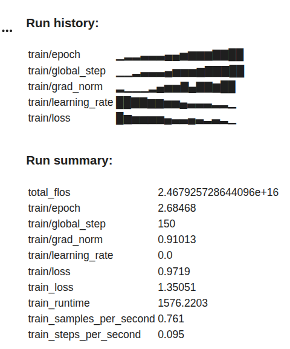
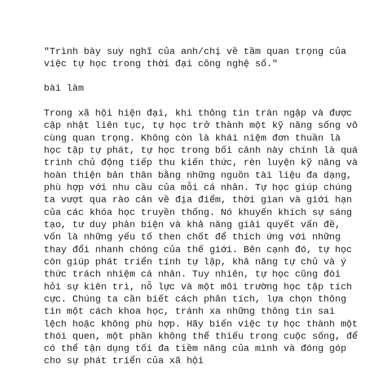

# 📝 NLXH-GenAI: Fine-tuning Qwen 2.5 for Vietnamese Social Discussion

Dự án này tập trung vào việc tinh chỉnh (Fine-tuning) mô hình ngôn ngữ lớn **Qwen 2.5 7B** để tối ưu hóa khả năng viết bài Nghị luận xã hội (NLXH) bằng tiếng Việt. Bằng cách sử dụng kỹ thuật **QLoRA** thông qua thư viện **Unsloth**, mô hình đạt được sự sắc bén trong lập luận văn học mà vẫn duy trì tốc độ suy luận cực nhanh.

### 🚀 Điểm nhấn kỹ thuật

* **Base Model:** Qwen 2.5 7B Instruct.
* **Phương pháp:** QLoRA (4-bit quantization).
* **Hiệu năng:** Tốc độ huấn luyện nhanh gấp 2 lần và giảm 70% VRAM nhờ Unsloth.
* **Định dạng xuất:** GGUF (Q4_K_M) – Sẵn sàng chạy trên máy tính cá nhân qua Ollama.

### 📊 Nhật ký huấn luyện (Training Logs)

Quá trình huấn luyện được thực hiện trong **150 steps** trên tập dữ liệu gồm **444 mẫu** chất lượng cao.

### 💡 Ví dụ kết quả (Inference)

Dưới đây là khả năng lập luận của mô hình đối với các chủ đề thực tế:

### ⚠️ Lưu ý

Mô hình được huấn luyện trên tập dữ liệu học thuật. Người dùng nên kiểm tra lại các dẫn chứng thực tế do AI sinh ra để đảm bảo tính chính xác tuyệt đối.
